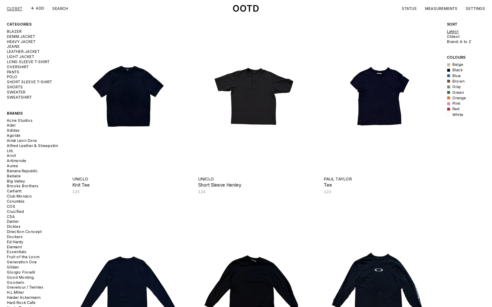

# OOTD

A self-hosted wardrobe app where every garment is photographed on a marker rig, cut out, and measured to the millimetre.



## Features

- Photograph a garment on a marker rig and get a clean cutout in the closet grid.
- Place a few pins and every dimension is stored in integer millimetres.
- Stores a number you can subtract, so fit can be arithmetic instead of a guess.
- Self-hosted: one Docker Compose stack, CUDA cutouts on a homelab GPU.

## Quick start

```bash
cp .env.example .env
docker compose up -d --build      # app on http://localhost:3000, no GPU needed
```

On a box with an NVIDIA GPU, add `-f docker-compose.yml -f docker-compose.gpu.yml` for CUDA cutouts.
Enter your rig's marker spans in Settings before the first capture.
Full setup, dev mode and backups: [docs/setup.md](docs/setup.md).

## Docs

- [Architecture](docs/architecture.md) - the app, Postgres and the Python worker, and how they share work
- [Capture](docs/capture.md) - the add flow and shot lists
- [Rig and scale](docs/rig-and-scale.md) - how a phone photo becomes millimetres
- [Measure](docs/measure.md) - pins, templates and the measure screen
- [Model licensing](docs/model-licensing.md) - why only commercially licensed models are used
- [Roadmap](docs/specs/roadmap.md) - planned work in build order
