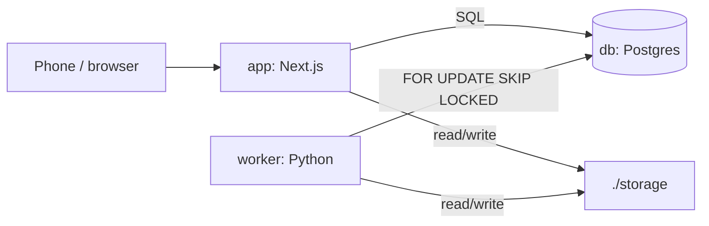

# Architecture

Three containers on one box: a Next.js app, Postgres, and a Python worker that share a job table and a storage folder.

## Why

Capture happens on a phone over the LAN, while image work needs a GPU and minutes of compute.
Splitting the request path (app) from long-running work (worker) keeps every screen responsive.
Sharing Postgres and `./storage` instead of a broker or object store keeps it to one `docker compose up`.

## How it works

- **app:** route handlers under `src/app/api/` are the whole backend.
  It writes rows, enqueues jobs, and serves media from `./storage`.
  It applies pending migrations on start, then serves.
- **db:** all data, and the job queue.
  Published on host port 5433.
- **worker:** claims jobs and writes cutouts and tiles.
  Segmentation (BiRefNet) runs locally, on CUDA when available.
  `GET :8000/health` reports its provider and counters, read by `/status`.

### Request flows

- **Capture:** the client detects markers and solves the homography, then uploads the original with its matrix.
  That creates a `photo` row and a `cutout` job.
  Close-ups upload with no markers and no job.
  Add to closet sets `garment.completed_at`.
- **Cutout:** the worker claims the job, runs the provider, and writes the cutout, a closet tile and a large picture.
  It records path, provider and garment bounds on the photo.
- **Activity:** the UI follows jobs by polling `/api/jobs`.

## Tech

Next.js App Router, Drizzle, Postgres, Python with FastAPI and psycopg, BiRefNet via transformers, Docker Compose with an NVIDIA overlay (`docker-compose.gpu.yml`).

## Key files

- `docker-compose.yml` - db, app, worker; `pgdata` and `hfcache` volumes
- `docker-compose.gpu.yml` - CUDA overlay for the worker
- `Dockerfile` - app image; runs `scripts/migrate.mjs` before `server.js`
- `worker/worker/main.py` - job loop, tile drawing, health endpoint
- `src/lib/providers/`, `worker/worker/providers/` - swappable vendors, chosen by env var

## Decisions and gotchas

- **Next.js route handlers are the whole API:** one deployable, in a framework known well; there is no separate backend service.
- **Docker Compose on the homelab (RTX 3070):** one command brings up everything, reachable from the phone over the LAN or Tailscale.
- **Cost is accepted over cheapness:** one user, and quality matters more.
- Originals are never modified, so every derived image can be regenerated by a batch job.
- There is no separate `migrate` service: the app container migrates itself on start.

## Related

- [Job queue](job-queue.md)
- [Media storage](media-storage.md)
- [Rig and scale](rig-and-scale.md)
- [Data model](data-model.md)
- [Setup](setup.md)
- [Model licensing](model-licensing.md)
